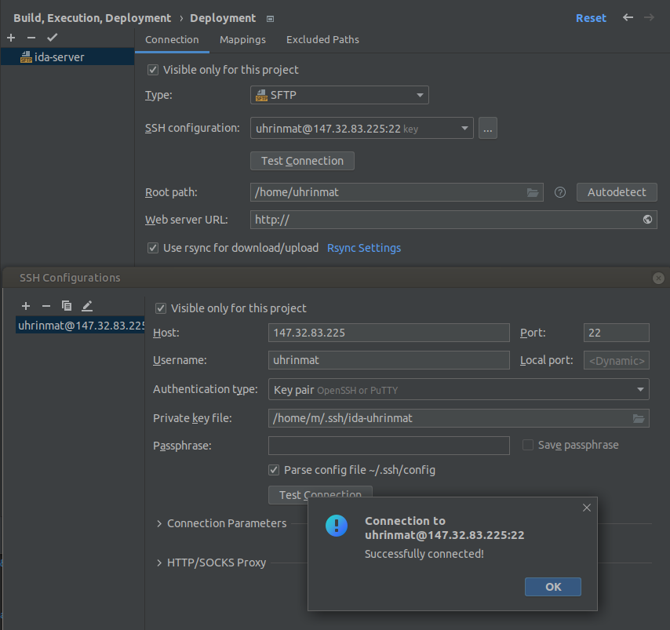
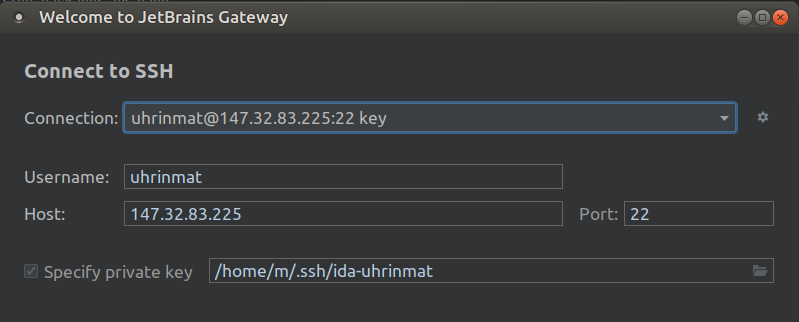
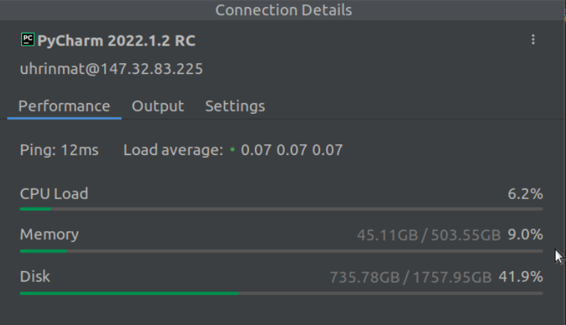
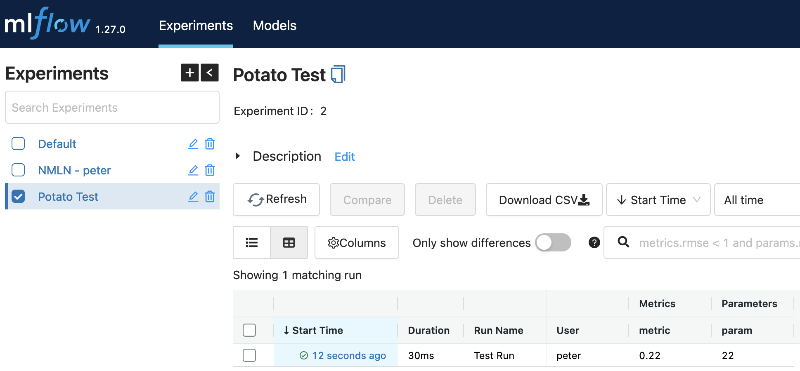

IDA server (aka "Potato")
===========================
currently at *147.32.83.225*, *potato.felk.cvut.cz* soon.

Installed software
----------------

.. list-table::
   :widths: 15 15

   * - docker
     - 20.10.11
   * - docker-compose
     - 2.6.1
   * - cuda
     - 11.4
   * - mc
     - 4.8.24

(Should you need anything else, let me know through github issues `here <https://github.com/mat-ej/potato-server>`_.)

SSH keys
---------------
For server access you need to generate your own ssh keypair. Follow instructions here:

https://www.ssh.com/academy/ssh/keygen

choose any algorithm and send me the public key i.e. one with the .pub suffix.

SSH config
-----------------
To make our lives easier, we'll add potato into ssh config file **~/.ssh/config** ,(create if it is not there) as follows:

.. code-block:: bash

    Host potato
    HostName 147.32.83.225
    User uhrinmat
    Port 22
    IdentityFile ~/.ssh/ida-uhrinmat

The following should then work.

.. code-block:: bash

    ssh uhrinmat@potato

SSH tunnel
----------------
Server is currently firewalled in a way that you can only reach the server through ssh.
Hence, whenever you need to run an app where you need more than simple CLI interaction e.g. mlflow, jupyterlab... you need to "expose" it through a tunnel.

**Example:** ssh tunnel for postgres running on the server's localhost:5432. We want to make this postgres accessible on our localhost:1111.

.. code-block:: bash

    ssh -N -L 1111:localhost:5432 uhrinmat@potato

Docker
----------------
Sure, you can easily set your environment through conda and run your code directly. However, conda often isn't as portable as one would hope.
Most likely outcome when porting a project using pure conda onto clusters is the following process:

    #. solving environment for 15 minutes
    #. fails
    #. solving conflicts for 45 minutes
    #. try removing conflicting packages by hand
    #. go to 1.

Hence a better idea might be to use a Dockerfile.

**NOTE**: Using docker for dependency management will allow you to easily port between different clusters. As an example you can use the Dockerfile below:

.. code-block:: docker

    ARG BASE_IMAGE=python:3.8

    FROM ${BASE_IMAGE} as base

    # Use the opt directory as our dev directory
    WORKDIR /opt

    ENV PYTHONUNBUFFERED TRUE

    COPY requirements.dev .

    # Install python dependencies
    RUN pip install --upgrade pip \
        && pip install --no-cache-dir wheel \
        && pip install --no-cache-dir -r requirements.dev \
        && pip list

Where *requirements.dev* is your typical requirements.txt file.

**NOTE**: pip is a better idea for dockerfiles as conda blows up the image size substantially.
But conda is doable as well. For more options check the provided links below.

Now we only need to build our dockerfile, tag it as dev environment and then run it.
The docker run command below attaches the current LOCAL working directory *($pwd$)* to */opt* directory INSIDE the docker container.

.. code-block:: bash

    docker build -t dev -f Dockerfile .
    docker run  --cpus=8 --memory=32GB --rm -it --name dev-env -v $(pwd):/opt -t dev bash

**NOTE**: We restrict the maximum available resources with --cpus and --memory params. Complete set of options such as gpus... can be found `here <https://docs.docker.com/config/containers/resource_constraints/>`_.

This should open up a bash command line inside the docker container and we can simply run whatever we intended.

.. code-block:: bash

    root@0267b5398a62:/opt# python train_pytorch.py

You can easily set up any IDE for any programming language to use this docker container to run your scripts, this way your dev environment stays consistent and somewhat portable.

E.G. Pycharm: **CTRL-shift-a -> Switch python interpreter -> Add Interpreter -> Docker -> Image name = dev -> Add**

**NOTE:** Full docker example for project/dependency management with tests and more:

https://eugeneyan.com/writing/setting-up-python-project-for-automation-and-collaboration/#alternatively-use-docker-as-a-dev-environment-instead

also a good read for python env management:

https://yxtay.github.io/blog/python-environment-package-dependency-management/

PyCharm remote host
--------------------------
Another option is to use pycharm as a SFTP client:
**Tools>Deployment>Browse Remote Host**

Add remote host through ssh, sftp there. All else should be straightforward.

Jetbrains gateway (beta)
--------------------------
Git clone your project into your home directory on the server and then
setting up gateway connection should be pretty straightforward.

When the connection is set up you should be able to see the following performance monitoring when you click on the conn.

What I found is that jetbrains often leaves zombie processes such as *"JetBrains/RemoteDev"* running on the server even after stopping the python script and closing connection,
especially when debugging. Hence you might need to do the following when exiting the remote connection.

.. code-block:: bash

    $ htop
    $ pkill jetbrains -U uhrinmat

Check if any JetBrains processes running with htop and pkill them with a username specified.

MLFlow
--------------------------

https://mlflow.org/ is an open source platform for the machine learning lifecycle.

To use it in your code, simply set environment variable `MLFLOW_TRACKING_URI` to

- `http://host.docker.internal:2222` if you are running in Docker + configure extra hosts for your container `host.docker.internal:host-gateway`
- `http://localhost:2222` if you are running without the docker

To open the MLFlow UI, port-forward port 2222 to your computer and open `http://localhost:2222`.

Example code snippet:

.. code-block:: python

    import os
    import mlflow

    # Set env. variable programatically.
    os.environ['MLFLOW_TRACKING_URI'] = 'http://localhost:2222'

    # Set your experiment name, I recommend one per project per person, e.g. something like "NMLN - peterjung"
    mlflow.set_experiment('Potato Test')

    # Start run
    with mlflow.start_run(run_name='Test Run') as run:
        # Log some things. See MLFlow's documentation for all the possibilities.
        mlflow.log_metric('metric', 0.22)
        mlflow.log_param('param', 22)

**NOTE:** We are running a (beta) server on Potato, it's considered beta because:

- it's using sqlite database stored as a single file on Potato's disk
- artifacts (uploaded files) are stored locally on Potato'disk as well

That means there is no backup and you are filling space on Potato. If it becomes a problem, we can deal with a more robust deployment solution.

Deployment repository is https://github.com/nmln-team/mlflow/, there is `/etc/systemd/system/docker-compose-mlflow.service` to start it up with docker automatically as a service.

Syncing files between your localhost and potato
--------------------------

To copy a single or a few files you can use 'scp'.

From potato to localhost:

.. code-block:: bash

    scp -r "peter@potato:~/projects/nmln-torch/poetry.lock" .

From localhost to potato:

.. code-block:: bash

    scp -r poetry.lock "peter@potato:~/projects/nmln-torch/poetry.lock"

But to synchronize entire folders with only small changes, rsync will be way faster.

From potato to localhost:

.. code-block:: bash

    rsync -avzurb --no-perms --del --backup-dir .backup --exclude '.git' "potato":"~/projects/nmln-torch/" .

From localhost to potato:

.. code-block:: bash

    rsync -avzurb --no-perms --del --backup-dir .backup . "potato":"~/projects/nmln-torch/"

With these rsync commands, anything that was deleted or overriden will be backuped in `.backup` directory, so you don't need to worry about accidentaly lossing your files.
